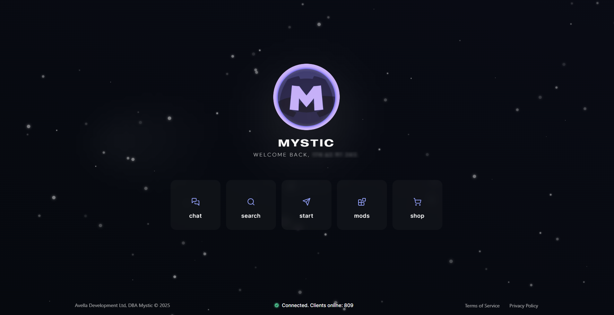
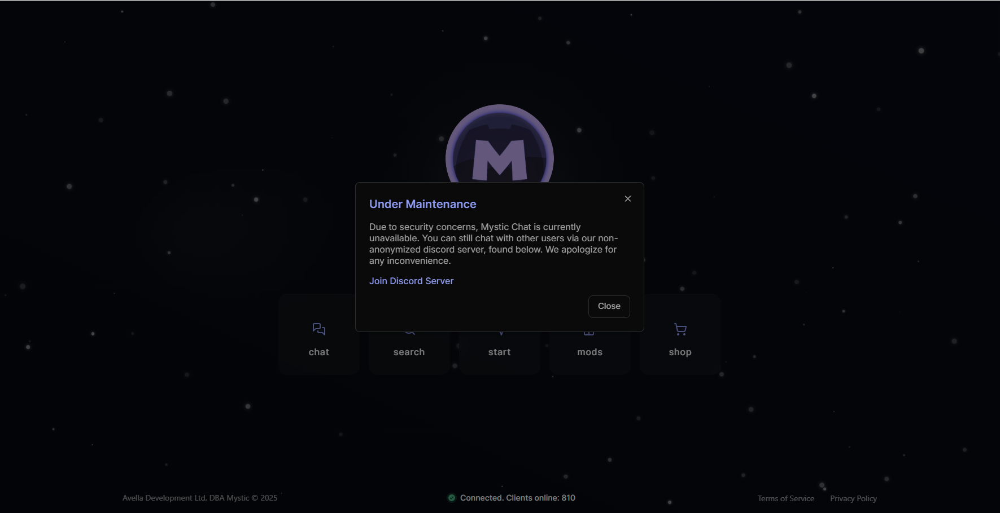
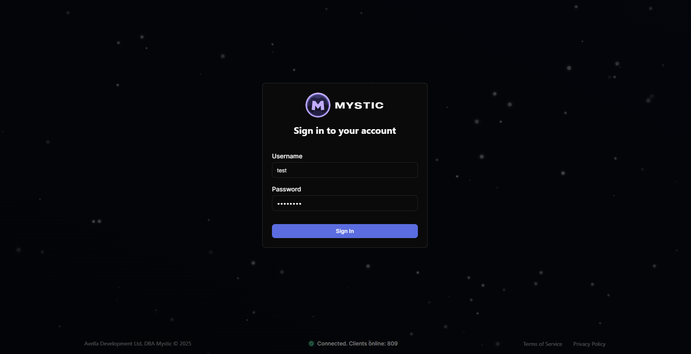

<!DOCTYPE html>
<html lang="en">
<head>
<meta charset="UTF-8">
</head>
<body>

    
    <h1>Mystic</h1>
    <h3>A minimalist, interactive, and animated web-portal demo.</h3>
	<h4>
	<a href="https://mystic.ac/">Click to visit Live Demo</a>
	</h4>

<h2>Features</h2>
<ul>
<li><strong>Dynamic loader</strong> – <code>loader.js</code> fetches pages from the <code>pages/</code> directory so routes remain simple and content is not duplicated.</li>
<li><strong>Animated hero interface</strong> with snow effects and a responsive card grid.</li>
<li><strong>Status badge</strong> embedded in the footer showing simulated node and user counts from PHP endpoints.</li>
<li><strong>Login form</strong> protected by Cloudflare Turnstile CAPTCHA, verified both client and server-side.</li>
<li><strong>Self destruct</strong> when the user opens DevTools to inspect page structure or execute code.</li>
<li><strong>Reusable</strong> modal system and embedded footer.</li>
</ul>

<h2>Screenshots</h2>
<h3>Home</h3>

<h3>Modal Popup</h3>

<h3>Login</h3>

<h2>API Endpoints</h2>

Most endpoints are intended for back‑end consumption. They all return JSON.

<table border="1" cellpadding="4" cellspacing="0">
<tr><th>Endpoint</th><th>Method</th><th>Description</th></tr>
<tr><td><code>/api/status</code></td><td>GET</td><td>Public endpoint that reports current status information.</td></tr>
<tr><td><code>/api/login/</code></td><td>POST</td><td>Validate credentials and start a session.</td></tr>
<tr><td><code>/api/register/</code></td><td>POST</td><td>Create a new user. Requires a registration token and is normally called from trusted services.</td></tr>
<tr><td><code>/api/logs/</code></td><td>POST</td><td>Write an entry to the server logs. Intended for internal use.</td></tr>
</table>

<h2>Security</h2>
<ul>
<li>Passwords are stored using PHP's <code>password_hash</code> with the default algorithm.</li>
<li>Sessions use secure, HTTP‑only cookies with the <code>SameSite=Lax</code> policy.</li>
<li>Cloudflare Turnstile protects the login form from bots.</li>
<li>API responses are JSON encoded and all input is validated server side.</li>
<li>Logs are kept per day in <code>database/logs</code> for auditing.</li>
</ul>

<h2>Technology</h2>
<ul>
<h3>No high-level frameworks are used. <em>Made with JS, CSS, HTML, and PHP.</em></h3>

<li>Modern ES modules organised into small self‑contained scripts.</li>
<li>Responsive CSS using custom fonts and a small set of utility classes.</li>
<li>PHP 8 code following strict types and returning structured JSON.</li>
</ul>

The project is intentionally minimal and up to date with current industry practices such as secure password handling and CAPTCHA verification.

</body>
</html>
